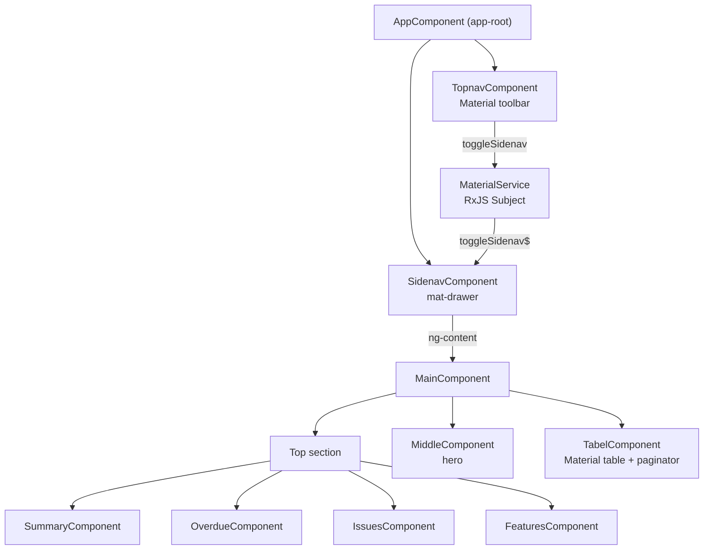

<div align="center">

# Angular GUI Boilerplate


**A ready-to-extend Angular 18 dashboard starter with a Material toolbar, a slide-out sidenav, and a Tailwind-styled layout.**

<!-- TODO: screenshot/GIF - capture the running app: top toolbar with menu button, the slide-out sidenav, and the dashboard cards plus the data table. -->

</div>

> **Status:** This is an early-stage UI boilerplate, not a finished product. The screens are wired with placeholder content (sample card numbers, a static table, and a profile block) so you can see the layout working and then swap in your own data and routes.

## Table of Contents

- [About](#about)
- [What's Included](#whats-included)
- [Tech Stack](#tech-stack)
- [Architecture](#architecture)
- [Getting Started](#getting-started)
- [How to Use as a Template](#how-to-use-as-a-template)
- [Project Structure](#project-structure)
- [Configuration](#configuration)
- [Roadmap](#roadmap)
- [Contributing](#contributing)
- [License](#license)

## About

Angular GUI Boilerplate is a starter layout for building admin and dashboard style web apps. It gives you the common shell pieces already assembled: a fixed top toolbar, a slide-out side navigation drawer, and a main content area split into summary cards, a hero section, and a data table.

The goal is to save the first hour of setup. Instead of wiring Angular Material and Tailwind together from scratch and laying out a responsive shell, you clone this, drop in your own components and routes, and start building features.

Everything uses Angular standalone components (no `NgModule` files), so the structure stays flat and easy to follow. Server-side rendering (SSR) is already configured through Angular's SSR and an Express server, so the app can render on the server out of the box.

## What's Included

- A top toolbar (`app-topnav`) with a menu button, a title, a dark-mode toggle control, a badge action button, and a profile image.
- A slide-out sidenav drawer (`app-sidenav`) built on Angular Material's `mat-drawer`, with a profile block and navigation buttons.
- A small RxJS service (`MaterialService`) that lets the toolbar button toggle the sidenav drawer through a shared `Subject`.
- A dashboard main area (`app-main`) composed of four summary cards, a middle hero section, and a Material data table with a paginator.
- Tailwind CSS set up alongside Angular Material, with a custom color extension as an example.
- Responsive tweaks (Tailwind `md:` breakpoints) so the layout adapts on smaller screens.
- SSR and prerendering configured via `@angular/ssr` and an Express `server.ts`.
- Component spec files scaffolded for Karma and Jasmine.

> **Note on placeholder content:** the sidenav and toolbar ship with sample personal details (a name, an email, and a profile image) and the cards and table contain dummy numbers. These are placeholders to demonstrate the layout. Replace them with your own data before you ship.

## Tech Stack

| Layer | Technology |
|-------|------------|
| Framework | Angular 18 (standalone components) |
| UI components | Angular Material 18 + Angular CDK |
| Styling | Tailwind CSS 3, PostCSS, Autoprefixer |
| Language | TypeScript 5.5 |
| Reactivity | RxJS 7 |
| Rendering | Angular SSR + Express 4 |
| Tooling | Angular CLI 18 |
| Testing | Karma + Jasmine |

## Architecture



The toolbar and the sidenav are decoupled. The toolbar's menu button calls `MaterialService.toggleSidenav()`, which pushes a value through an RxJS `Subject`. The sidenav subscribes to that stream and toggles its `mat-drawer`. This keeps the two components independent and easy to move around.

## Getting Started

### Prerequisites

```bash
node --version   # Node.js 18 or newer
npm --version
```

### Installation

```bash
git clone https://github.com/atiqbitstream/Angular-Gui-Boilerplate.git
cd Angular-Gui-Boilerplate
npm install
```

### Run the dev server

```bash
npm start
```

Then open `http://localhost:4200/`. The app reloads automatically when you change source files.

### Build

```bash
npm run build
```

Build output is written to the `dist/` directory.

### Run with server-side rendering

```bash
npm run build
npm run serve:ssr:layoutWebApp
```

### Run unit tests

```bash
npm test
```

## How to Use as a Template

1. Click **Use this template** on GitHub (or clone this repo) to start a fresh project.
2. Install dependencies with `npm install`.
3. Define your real routes in `src/app/app.routes.ts` (it ships empty) and add a `<router-outlet>` where you want routed views.
4. Replace the placeholder profile name, email, and images in `src/app/sidenav/sidenav.component.html` and `src/app/topnav/topnav.component.html`.
5. Swap the dummy card numbers in `src/app/top-section/` and the static table rows in `src/app/lower-section/tabel/` for your own data, ideally fed by a service.
6. Adjust the theme: edit `tailwind.config.js` for colors and spacing, and customize Angular Material as needed.

## Project Structure

```text
src/
├── app/
│   ├── app.component.*          # Root shell: topnav + sidenav + main
│   ├── app.config.ts            # Standalone app providers (router, hydration, animations)
│   ├── app.config.server.ts     # SSR providers
│   ├── app.routes.ts            # Route definitions (empty, ready to fill)
│   ├── topnav/                  # Material toolbar
│   ├── sidenav/                 # mat-drawer side navigation
│   ├── main/                    # Dashboard content container
│   ├── top-section/             # Summary, overdue, issues, features cards
│   ├── middle-section/middle/   # Hero section
│   ├── lower-section/tabel/     # Material data table + paginator
│   └── services/material.service.ts  # RxJS toggle bridge for the sidenav
├── index.html
├── main.ts                      # Browser bootstrap
├── main.server.ts               # Server bootstrap
└── styles.css                   # Global styles + Tailwind directives
server.ts                        # Express server for SSR
tailwind.config.js               # Tailwind configuration
angular.json                     # Angular CLI workspace config
```

## Configuration

This boilerplate has no environment variables or `.env` file. The settings you will most likely touch are:

| File | What it controls |
|------|------------------|
| `tailwind.config.js` | Tailwind theme, custom colors, and the content scan paths |
| `src/styles.css` | Global styles and the `@tailwind` directives |
| `src/app/app.routes.ts` | Application routes (empty by default) |
| `angular.json` | Build, serve, and SSR configuration |
| `package.json` | npm scripts |

The dev server runs on port `4200` by default. To change it, run `npm start -- --port <port>`.

## Roadmap

- [ ] Add example routes and a `<router-outlet>`
- [ ] Wire the dark-mode toggle to an actual theme switch
- [ ] Move card and table data into a service with typed models
- [ ] Replace placeholder profile and images with configurable inputs
- [ ] Add a real authentication or settings page as an example
- [ ] Expand unit test coverage beyond the scaffolded specs

## Contributing

Contributions are welcome. Open an issue to discuss a change, or fork the repo and send a pull request.

## License

Distributed under the MIT License. See [LICENSE](LICENSE).
