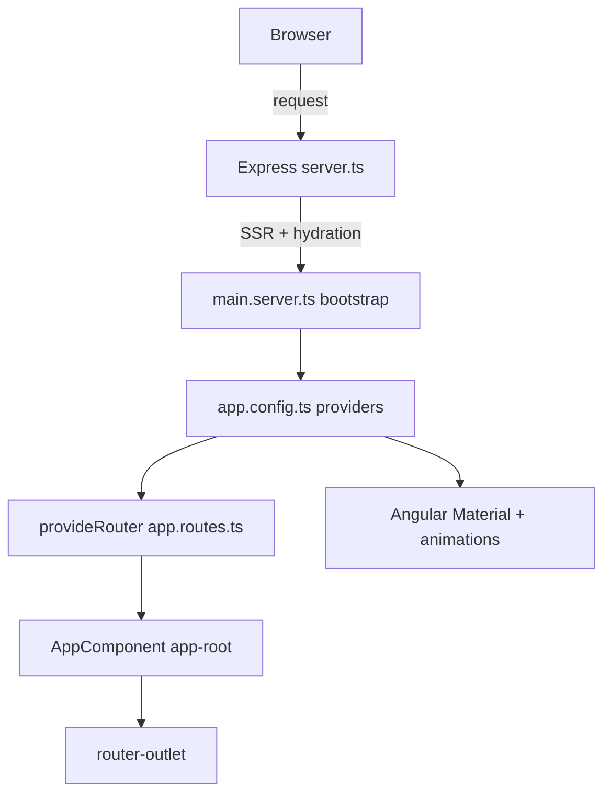

<div align="center">

# Angular GUI Boilerplate


**A starter template for building Angular 18 web apps, with standalone components, Angular Material, and server-side rendering already wired up.**

<!-- TODO: screenshot/GIF - capture the running app at http://localhost:4200 (the default landing page, and the Material sidenav/topnav layout from the web-app branch) -->

</div>

> [!NOTE]
> This is an early-stage boilerplate. The default branch (`master`) is a clean Angular 18 CLI scaffold: standalone components, Angular Material, and SSR are configured, and the routing table is empty so you can start fresh. A more complete dashboard layout (Material sidenav, top toolbar, and Tailwind CSS) is in progress on the `web-app` and `repsponsiveness` branches and has not been merged to `master` yet. See [Roadmap](#roadmap).

## Table of Contents

- [About](#about)
- [What's Included](#whats-included)
- [Tech Stack](#tech-stack)
- [Architecture](#architecture)
- [Getting Started](#getting-started)
- [Using It as a Template](#using-it-as-a-template)
- [Project Structure](#project-structure)
- [Configuration](#configuration)
- [Roadmap](#roadmap)
- [Contributing](#contributing)
- [License](#license)

## About

Angular GUI Boilerplate gives you a ready-to-extend Angular 18 project so you do not have to set up the same scaffolding every time you start a new app. It uses the modern standalone-component style (no `NgModule` boilerplate), ships with Angular Material for UI components, and has server-side rendering (SSR) plus client hydration configured through `@angular/ssr` and an Express server.

The default branch is intentionally minimal: an empty route table and the standard Angular CLI landing page. That keeps it a clean base you can clone and build on. The `web-app` branch shows where the project is heading, with a Material drawer sidenav, a top toolbar, and a dashboard-style content area styled with Tailwind CSS.

## What's Included

- Angular 18.2 application using standalone components (no `AppModule`).
- Angular Material 18.2 plus the Angular CDK, with the Azure/Blue prebuilt theme applied.
- Server-side rendering and client hydration set up via `@angular/ssr` and an Express server (`server.ts`).
- Async animations provider (`provideAnimationsAsync`) and zone event coalescing enabled.
- Karma plus Jasmine test runner configured out of the box.
- Production build budgets and output hashing already defined in `angular.json`.
- Roboto font and Material Icons linked in `index.html`.

## Tech Stack

| Layer | Technology |
|-------|------------|
| Framework | Angular 18.2 (standalone components) |
| Language | TypeScript 5.5 |
| UI components | Angular Material 18.2 + Angular CDK |
| Rendering | Server-side rendering via `@angular/ssr` |
| Server | Express 4 (`server.ts`) |
| Reactivity | RxJS 7.8 |
| Tooling | Angular CLI 18.2 |
| Testing | Karma + Jasmine |
| Styling (default branch) | Angular Material prebuilt theme + global CSS |
| Styling (web-app branch) | Tailwind CSS 3.4 + Angular Material |

## Architecture



## Getting Started

### Prerequisites

You need Node.js (version 18.18 or newer, matching the project's `@types/node`) and npm. Installing the Angular CLI globally is optional but handy.

```bash
node --version
npm install -g @angular/cli@18
```

### Installation

```bash
git clone https://github.com/atiqbitstream/Angular-Gui-Boilerplate.git
cd Angular-Gui-Boilerplate
npm install
```

### Run the development server

```bash
npm start
```

This runs `ng serve`. Open `http://localhost:4200/` in your browser. The app reloads automatically when you change source files.

### Build for production

```bash
npm run build
```

Build output goes to the `dist/layout-web-app/` directory.

### Run with server-side rendering

```bash
npm run build
npm run serve:ssr:layoutWebApp
```

The SSR server listens on `http://localhost:4000/` by default (override with the `PORT` environment variable).

### Run unit tests

```bash
npm test
```

Tests run through Karma and Jasmine.

## Using It as a Template

1. Click "Use this template" on GitHub, or clone the repo and point it at your own remote.
2. Run `npm install`.
3. Add your routes in `src/app/app.routes.ts` (it starts empty).
4. Generate new pieces with the Angular CLI, for example:

```bash
ng generate component features/dashboard
ng generate service core/api
```

5. Replace the placeholder landing page in `src/app/app.component.html` with your own layout. If you want the Material sidenav and toolbar layout, check out the `web-app` branch for a working example.

## Project Structure

```text
Angular-Gui-Boilerplate/
├── src/
│   ├── app/
│   │   ├── app.component.ts        # Root standalone component (app-root)
│   │   ├── app.component.html      # Placeholder landing page + router-outlet
│   │   ├── app.routes.ts           # Route table (empty, ready for your routes)
│   │   ├── app.config.ts           # Browser providers (router, hydration, animations)
│   │   └── app.config.server.ts    # Server-side providers
│   ├── main.ts                     # Browser bootstrap
│   ├── main.server.ts              # Server bootstrap
│   ├── index.html                  # HTML shell
│   └── styles.css                  # Global styles
├── public/                         # Static assets (favicon)
├── server.ts                       # Express SSR server
├── angular.json                    # Angular CLI workspace config
├── package.json                    # Scripts and dependencies
└── tsconfig*.json                  # TypeScript configs
```

## Configuration

| Variable | Description | Default |
|----------|-------------|---------|
| `PORT` | Port the SSR Express server listens on | `4000` |

The Angular dev server (`npm start`) always uses port `4200`. The internal Angular project name is `layoutWebApp`, which is why build output lands in `dist/layout-web-app/`.

## Roadmap

- [x] Angular 18 scaffold with standalone components
- [x] Angular Material and CDK integrated
- [x] Server-side rendering with Express
- [ ] Merge the Material sidenav and top toolbar layout from `web-app` into the default branch
- [ ] Bring in Tailwind CSS on the default branch
- [ ] Add a responsive dashboard layout with summary, issues, overdue, and features sections
- [ ] Add example routes and lazy-loaded feature areas
- [ ] Add a real landing page in place of the CLI placeholder

## Contributing

Contributions are welcome. Open an issue to discuss a change, then send a pull request. Please keep components standalone and follow the existing Angular CLI project layout.

## License

Distributed under the MIT License. See [LICENSE](LICENSE) for details.
